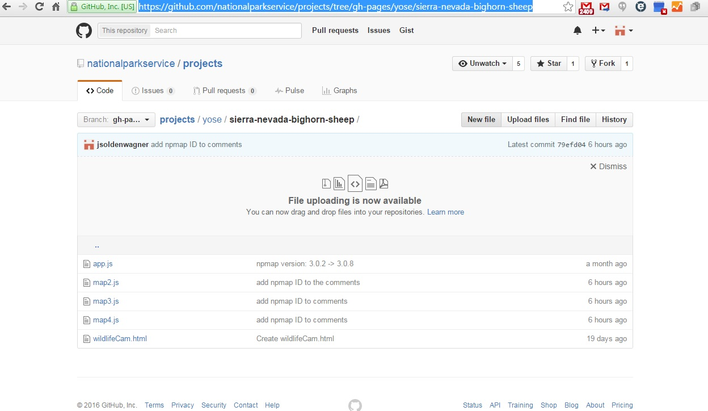

# bighorn-tracks
A guide to updating the animated bighorn map:

  This is a guide to updating the bighorn map.  The map is created by a script (written in javascript) that lives here:
  
  http://github.com/nationalparkservice/projects/tree/gh-pages/yose/sierra-nevada-bighorn-sheep
  
  
  
  The initial map is linked to app.js. Additional maps are linked to map2.js, map3.js, and map4.js. 
  These maps can be published to nps.gov pages by referencing their assigned ID's. NPMap ID's are assigned by Nate Irwin. More ID's can be requested by contacting Nate via email at nate_irwin@nps.gov.
  
### To Edit An Existing Map: 
