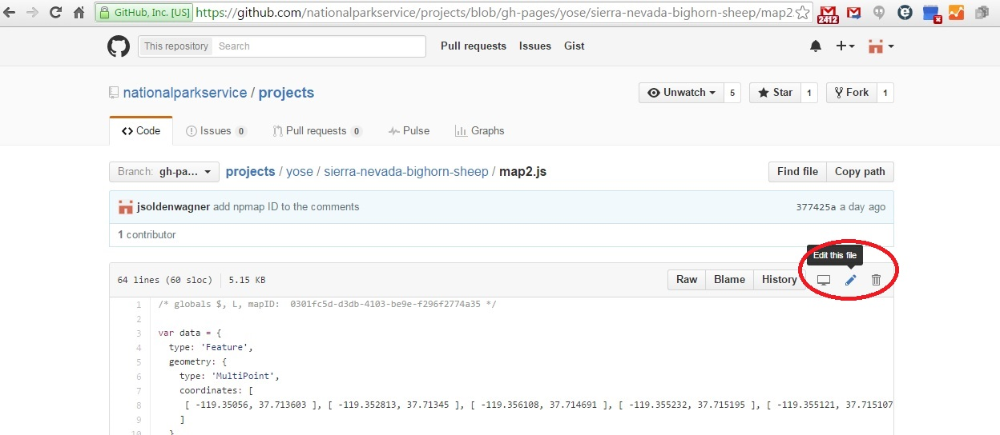

# bighorn-tracks
##A guide to updating the animated bighorn map:

This is a guide to updating the bighorn map.  The map is created by a script (written in javascript) that lives here:
  
http://github.com/nationalparkservice/projects/tree/gh-pages/yose/sierra-nevada-bighorn-sheep
  

  
The initial map is linked to app.js. Additional maps are linked to map2.js, map3.js, and map4.js. 
These maps can be published to nps.gov pages by referencing their assigned ID's. NPMap ID's are assigned by Nate Irwin and more can be requested by contacting Nate via email at nate_irwin@nps.gov or npmap@nps.gov.
  
###To Edit An Existing Map: 

Click on the {your map name goes here}.js file that you want to edit, map2.js in this tutorial, and then select 
the pen icon to make edits:



Edits can be made to the GPS track, the map's `center` and `zoom`, and the text above the time-slider control. 
Let's look at each of these in turn.

###The GPS Track
The bighorn map generates the GPS track from GeoJSON data that can be found in the `data` variable and looks like so:
```javascript
var data = {
  "type": "Feature",
  "geometry": {
    "type": "MultiPoint",
    "coordinates": [/*array of [long,lat] coordinates*/]
  },
  "properties": {
    "time": [/*array of UNIX timestamps*/]
  }
};
```
To update the track, simply paste new arrays of [long,lat] coordinates and UNIX timestamps into the appropriate [].
For clarity:
```javascript
var data = {
  "type": "Feature",
  "geometry": {
    "type": "MultiPoint",
    "coordinates": [[long1,lat1], [long2,lat2],[long3,lat3],...,[longN,latN]]
  },
  "properties": {
    "time": [timestamp1, timestamp2, timestamp3,...,timestampN]
  }
};
```
Note that the size of these two arrays must be the same.  These arrays can be generated by the ui.R script found in this repository.
More on this later in the tutorial.
###Setting the Map's Center and Zoom
The `center` and `zoom` can be found in the `NPMap` variable:
```javascript
var NPMap = {
  div: 'map',
  center: {
    lat: 37.744275,
    lng: -119.330004
  },
  [...]
  zoom: 13,
  maxZoom: 15
};
```
When you update the GPS track you will most likely need to reset the `center` and `zoom`.  Coordinates for the `center` can be obtained by using [Google Maps](https://www.google.com/maps) right-click `What's here?` feature. Simply mouse over a point that would make a good `center`, right-click and select `What's here?`, then click on the coordinates to copy and paste the `lat` and `lng`. 
The `zoom` level can range from 1 to 15, with greater numbers indicating a greater zoom (`zoom: 1` being completely zoomed out).
###Setting the Text for the Time-Slider Control
The text for the time-slider can be found in the `hooks` property of the `NPMap` variable:
```javascript
var NPMap = {
  div: 'map',
  [...]
  hooks: {
    init: function (callback) {
      [...]
      $(document).ready(function () {
        $('div.leaflet-bottom.leaflet-left').prepend('<p><b>EWE S375: 5/17/2015 to 7/5/2015</b></p>');
      });
      callback();
    }
  },
  [...]
  zoom: 13,
  maxZoom: 15
};
```
In this example the text above the time-slider is set by the HTML: `<p><b>EWE S375: 5/17/2015 to 7/5/2015</b></p>`.
Set the text for the animal and date range that corresponds to your GPS track.
###Creating a New Map
To create a new map click on the `New file` button:


Give the new {your map name goes here}.js file a fantastic name (ending in .js), then copy and paste the _entire_ code of an existing map or `template.js`:


Set the GPS track, `center`, `zoom`, and time-slider control text as described in this tutorial and commit the 
new file:


Send an email to nate_irwin@nps.gov or npmap@nps.gov with the name of the new file and request a new NPMap ID.
When you receive the ID, which will look something like `0301fc5d-d3db-4103-be9e-f296f2774a35`, paste it into the comments section at the top of your new file:

![](screenshots/


